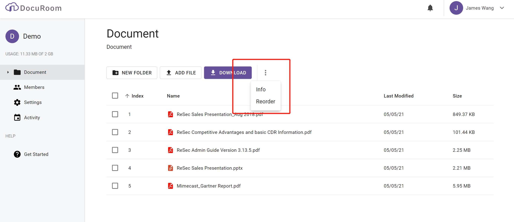

# Data Room Operation

## Navigation

There are several buttons displayed at the top of file explorer.

* New Folder: Create the folder
* Add File: Upload multiple selected File. If you want to upload file in batch, you can drag and pull the files or folder from your PC into web page.
* Download: download the selected file.
* Info: show the selected file information
* Reorder: Data Room Coowner can drag and put files to arrange files in the desired order.

## New Folder

## Add File

After clikc "Add File" , the File Open Dialog is displayed, you can multiple selecte file by CTRL

## Reorder

Click **...** \|  **Reorder**, the explorer will enter Reorder status. User can rearrange the order of file / folder list.

User drag the items to move up and down. Click **DONE** to exit the **Reorder** status.

