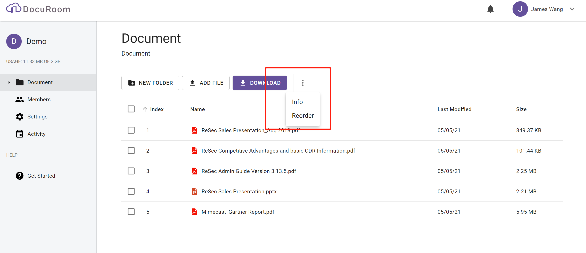

# User Enrollment

The user will receive an email to register the user in Docuroom.com

Click the link and follow the instruction to register the user.

Click "CREATE ACCOUNT". After then, you can enable OTP or login through Office365 if your email can be authorized by Microsoft Office365.

Confirm DNA to complete the process.

## How to enable One Time Password for your account ?

One Time password \(OTP\) can be used to protect your account.

Click **Profile** to edit your account information.

Enable **Two-Factor Authentication**

Download 2FA app like Microsoft Authenticator, Google Authenticator, FreeOTP to scan the QRCode. You can get a 6 numbers code and then input into the text box to verify the 2FA App.

